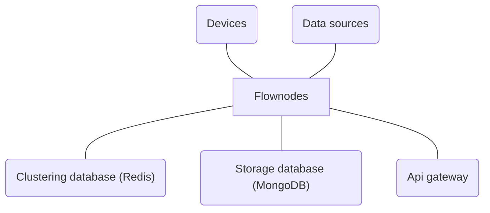

<h1 align="center">
    <picture>
        <source media="(prefers-color-scheme: dark)" srcset="./assets/logo-rectangle_white.png">
        
    </picture>
</h1>

**A distributed automation platform.**
 
 

Flownodes is an experimental automation distributed platform designed to integrate devices and different kinds of data sources. The main focus of the application is to provide easy extendability with a user friendly SDK.

## Architecture

## Additional notes

This project is still in its early stages and not ready for production. You may encounter bugs and other kinds of issues.
