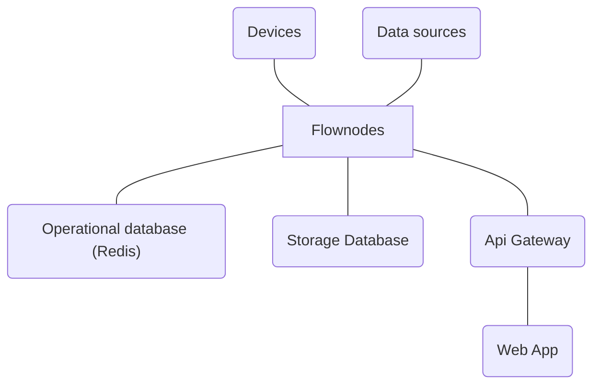

<h1 align="center">Flownodes</h1>

🦾 Experimental distributed automation platform.

Flownodes is an experimental automation distributed platform designed to integrate devices and different kinds of data sources. The main focus of the application is to provide easy extendability with a user friendly SDK.

## Architecture

## Additional notes

This project is still in its early stages and not ready for production. You may encounter bugs and other kinds of issues.