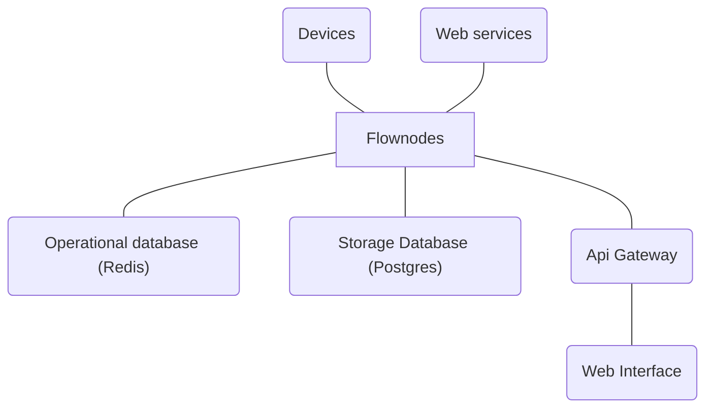

<h1 align="center">Flownodes</h1>

The distributed automation platform

## Introduction

Flownodes is a distributed platform designed for integrating and automating different kinds of environment. It's highly versatile and designed for either professional or home usage.

## Goals

The main goal of the project is to provide a low effort way to automate your existing environment without the strain of writing custom software.
Flownodes is also highly extendable by providing developers an SDK to develop a variety of components, such as:

- Device behaviors;
- Data object behaviors;
- Alerter drivers;
- And more to come...

## Architecture

## Technologies

The project is built mainly using the .NET platform.

## Additional notes

This project is still in its early stages. You may encounter bugs and other kinds of issues.
